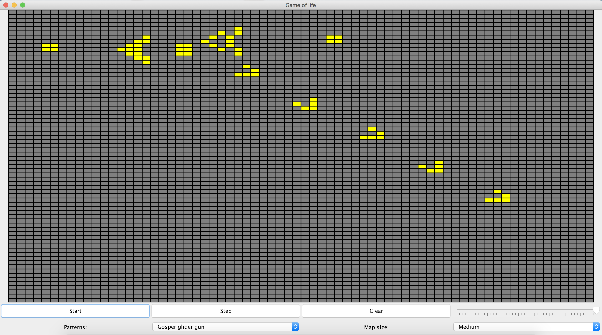

# Game Of Life

El juego de la vida es un autómata celular diseñado por el matemático británico John Horton Conway en 1970.

Hizo su primera aparición pública en el número de octubre de 1970 de la revista Scientific American, en la columna de juegos matemáticos de Martin Gardner. Desde un punto de vista teórico, es interesante porque es equivalente a una máquina universal de Turing, es decir, todo lo que se puede computar algorítmicamente se puede computar en el juego de la vida.

Desde su publicación, ha atraído mucho interés debido a la gran variabilidad de la evolución de los patrones. Se considera que la vida es un buen ejemplo de emergencia y auto-organización. Es interesante para los científicos, matemáticos, economistas y otros observar cómo patrones complejos pueden provenir de la implementación de reglas muy sencillas:
  * Cualquier célula viva con menos de 2 vecinas vivas, muere por despoblación.
  * Cualquier célula viva con 2 o mas vecinas vivas, vive en la siguiente generación.
  * Cualquier célula viva con mas de 3 vecinas vivas, muere por sobrepoblación.
  * Cualquier célula muerta con, exactamente, 3 vecinas vivas, nace por reproducción.
  
[Fuente Wikipedia](https://es.wikipedia.org/wiki/Juego_de_la_vida).

   

## [Guía para visualizar la Applet](https://github.com/AntonioGarnier/Applets)

## [Enlace a la gh-pages](https://antoniogarnier.github.io/GameOfLife_Conway)
